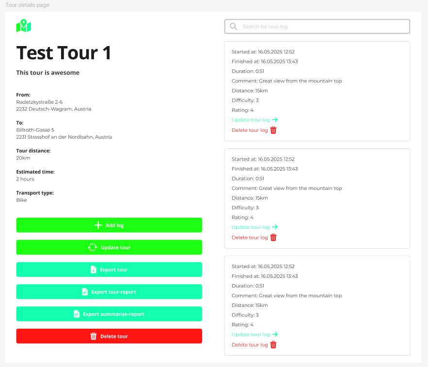

# BIF4 SWEN tour planner client

This repository contains the Frontend applications for the Tour Planner program, which currently allows users to create, view, update, and delete tours and tour logs.

# Overview

The Frontend is an Angular application that communicates with the backend API to manage tours and tour logs via a modern UI.

## Features

    Display tours and detailed tour information

    Create, update, and delete tours and tour logs

    Responsive design and intuitive navigation

    Client-side validation and error handling

## Prerequisites

    Node.js 19+

    npm or yarn

## Setup and Running

Install dependencies:

npm install

Start the Angular development server:

    npm start

Open your browser at:

    http://localhost:4200

## Project Structure Highlights

    src/app/service — API services for Tours and Tour Logs

    src/app/model — Data models and interfaces

    src/app/pages — Angular components for different views (Tour List, Tour Details, Tour Log creation)

    src/app/app-routing.module.ts — Routing configuration

## Usage

    Use the sidebar to navigate tours

    Click "Create" to land on the Create Tour Page

    Click “Add log” to create a new tour log

    Update or delete tours and logs using the provided buttons

## Notes

    Ensure backend is running before starting frontend to enable API calls

    API base URLs can be configured in Angular environment files (environment.ts)

    Error handling is done on both frontend and backend
